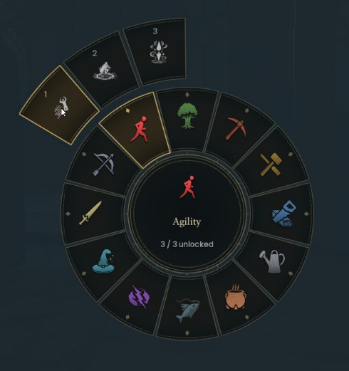

# BetterSpellWheel

A skill-based spell wheel for **RuneScape: Dragonwilds**. Press **Q**, hover a skill,
then move outward to choose a spell. Or use your controller to choose a skill,
browse its spells, and cast without reaching for the mouse.

## Your skills. Your magic.

- **39 spells across 12 skills**, grouped using the game's actual progression data.
- **Controller navigation:** stick or D-pad browsing, confirm/back, and matching button hints.
- **Large native icons and numbered spell slots**, with full names in a matching side list.
- **Spell details at a glance:** descriptions, unlock levels, base rune costs and cooldowns.
- **Normal game rules:** your unlocks, rune requirements, cooldowns and targeting still apply.
  Saved spellbook assignments are preserved.

[View the full interface](docs/preview.jpg)

## Download and install

**0.3.0 · Windows · Keyboard, mouse and controller beta**

| Download | Installation |
| --- | --- |
| [Easy installer (.exe)](https://github.com/Proxify/rsdw-betterspellwheel/releases/download/v0.3.0/BetterSpellWheel-0.3.0-setup.exe) | Close the game and run setup. It finds your Steam installation and installs UE4SS if needed. |
| [Manual install (.zip)](https://github.com/Proxify/rsdw-betterspellwheel/releases/download/v0.3.0/BetterSpellWheel-0.3.0.zip) | Follow the included `INSTALL.txt`. Requires Dragonwilds-compatible UE4SS already installed. |

The EXE is a separate download. Setup preserves other mods and your existing
settings on update; run it again to update or uninstall. The installer is unsigned.

Install on the client where you want the new wheel. PlayerTrading and RuneSchema
are not dependencies, and there is no server component.

**Coming from SpellBranches?** Close the game and remove its old mod folder and
`SpellBranches : 1` entry from `mods.txt` before installing BetterSpellWheel.
Keep only one wheel enabled.

[Full installation and troubleshooting guide](INSTALL.txt) · [Release notes](CHANGELOG.md)

## Controls

| Input | Action |
| --- | --- |
| Q / your normal spell-wheel binding | Open the wheel |
| Hover an inner skill icon | Reveal that skill's spells |
| Move outward + left-click | Select a spell, then use the game's normal casting controls |
| Return to the inner ring | Change skills |
| Right-click | Go back to skill selection |
| Q / Escape | Close without selecting |

With a controller:

| Input | Action |
| --- | --- |
| Y / Triangle (or your normal binding) | Open or close |
| Either stick | Point at a skill; after choosing it, tilt to browse spells |
| D-pad | Browse skills or spells, with hold-to-repeat |
| A / Cross | Choose the skill, then select its highlighted spell |
| B / Circle | Back to skills; press again to close |
| LB / RB or L1 / R1 | Change pages when a skill has more than six spells |

Release the stick after choosing a skill before browsing its spells. Selection
stays highlighted when the stick returns to center. Once a spell is selected,
use the game's normal targeting controls (RT / R2 to confirm, LT / L2 to cancel).
Moving the mouse switches back to mouse navigation. Button hints follow the
controller reported by the game; `ControllerPrompts=PlayStation` in `config.txt`
overrides Xbox hints when using Steam Input.

Locked spells remain visible with their required level. Costs and cooldowns shown
in the panel are base values; equipment and perks can change the actual values.
Hovering alone never casts a spell.

To disable the mod, set `Enabled=false` in `config.txt` and restart the game.

## Compatibility

Tested on **Dragonwilds 1.0 / UE 5.6**, Windows, at **1920×1080**. Controller input is tested with a virtual Xbox controller through the native
Windows input path. Physical controllers and native PlayStation input remain
unverified; PlayStation button labels can be selected in the config.

The controller flow was exercised on a client connected to a local dedicated
MODTEST server. Ultrawide/high-DPI displays, death or disconnect
while targeting, every individual spell effect, and other spell-wheel mods remain
unverified. See the [test report](tests/TEST-REPORT.md) for exact coverage.

## Development

Run `python tests/run.py` with Python and `lupa` installed. Artwork is generated
with `python tools/build_art.py` (Pillow). Game icons load from your installed game;
no game textures are redistributed.

Build the manual ZIP with `python tools/package.py`. Follow the
[installer build guide](installer/README.md) for the separate setup EXE and Windows
validation. Every release includes both files; developer consoles, tests and
runtime data are excluded from the downloads.
